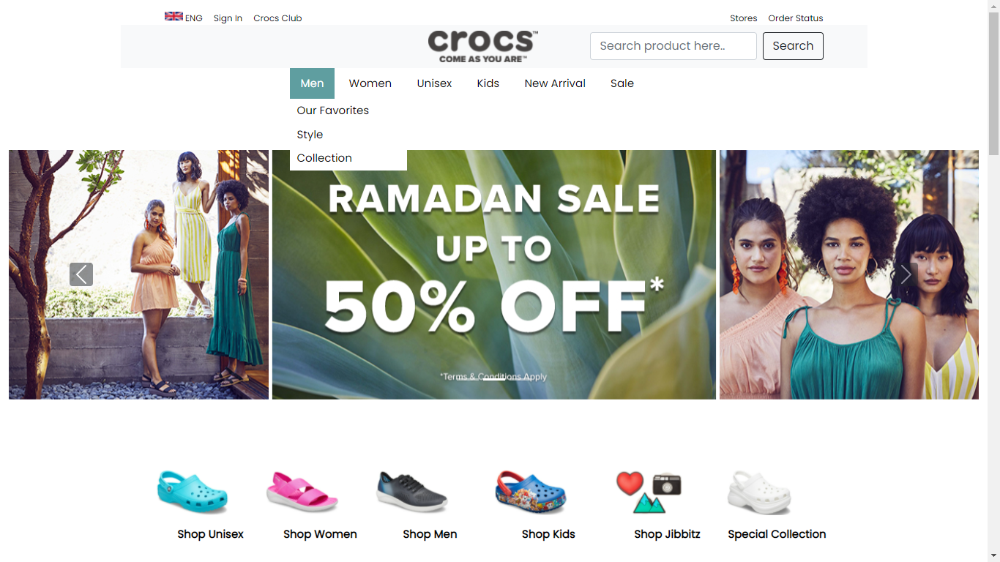
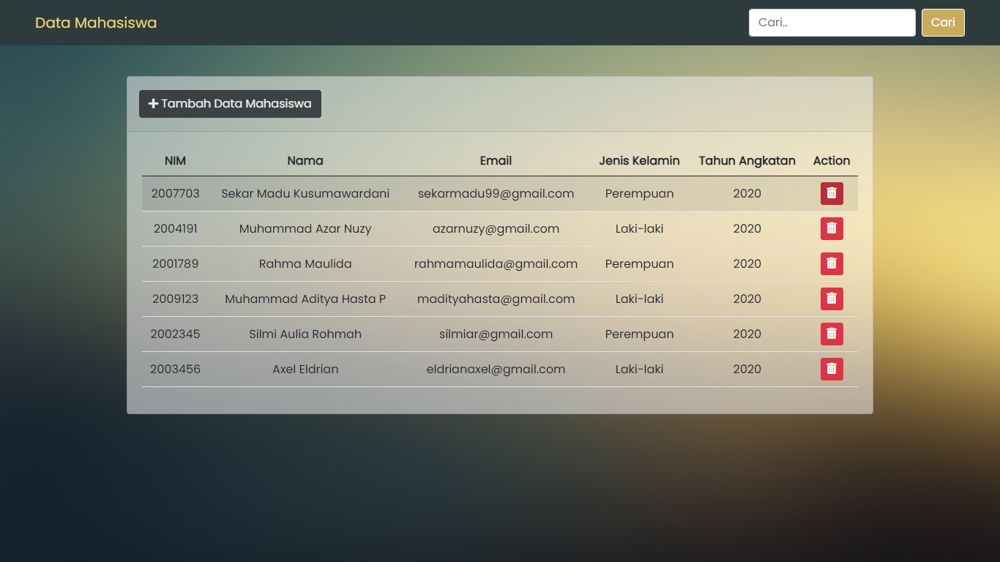
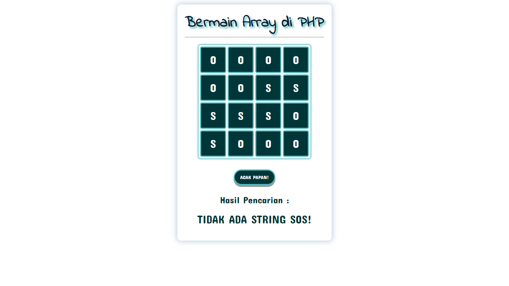

# Ostric-Bootcamp-Project2021
```
Created : July 24th 2021
```
> This repository contains all the projects that have been worked on in the Ostric Coding Bootcamp 2021.

## Preview
### Tugas 1


View my article : [https://ostric.kemakom.org/Home/view_article/9](https://ostric.kemakom.org/Home/view_article/9)

### Tugas 2


View my article : [https://ostric.kemakom.org/Home/view_article/10](https://ostric.kemakom.org/Home/view_article/10)

### Tugas 3


View my article : [https://ostric.kemakom.org/Home/view_article/11](https://ostric.kemakom.org/Home/view_article/11)

### Tugas 5


View my article : [https://ostric.kemakom.org/Home/view_article/8](https://ostric.kemakom.org/Home/view_article/8)

### Ostric's Website
[https://ostric.kemakom.org/](https://ostric.kemakom.org/)

### Tech
* [PHP](https://www.php.net/) - Hypertext Preprocessor, is the most popular server-side-scripting programming language especially for web development
* [CSS](https://www.w3.org/Style/CSS/Overview.en.html) - is a simple mechanism for adding style (e.g., fonts, colors, spacing) to Web documents.
* [JavaScript](https://www.javascript.com/) - a scripting language to create dynamically updating content, control multimedia, animate images, and pretty much everything else.

### Tools
* [XAMPP](https://apachefriends.org/) - an easy to install Apache distribution containing MariaDB, PHP, and Perl.
* [Visual Studio Code](https://code.visualstudio.com/) - a code editor redefined and optimized for building and debugging modern web and cloud applications.
* [Google Chrome](https:/google.com/) - a cross-platform web browser developed by Google.

### Credits
[Sekar Madu Kusumawardani](https://instagram.com/sekarmk03/)